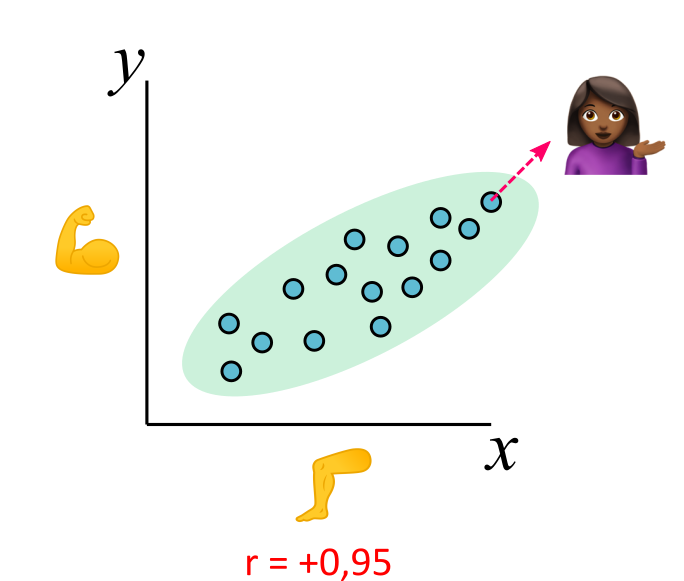
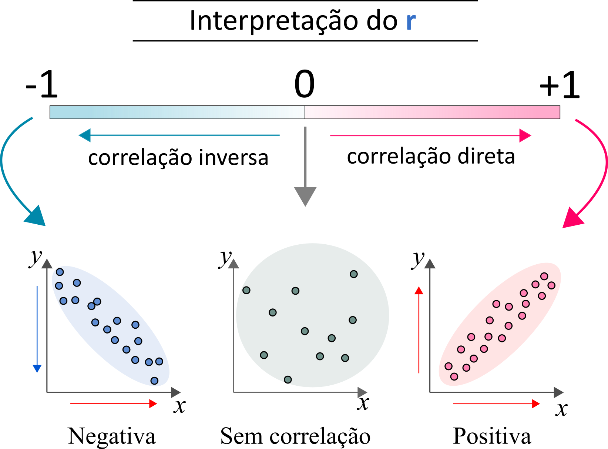
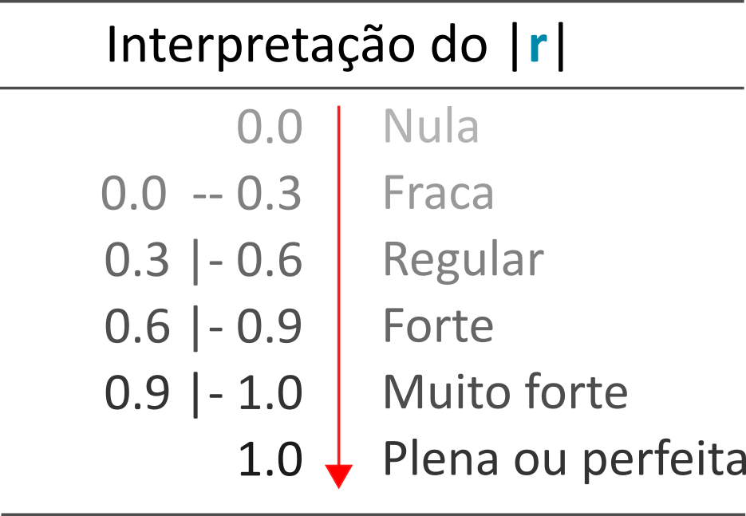
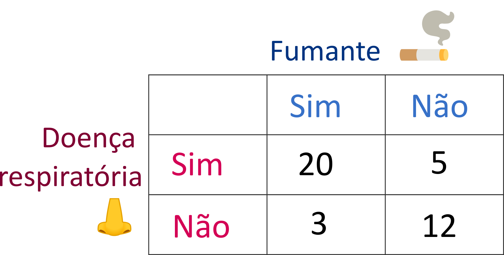
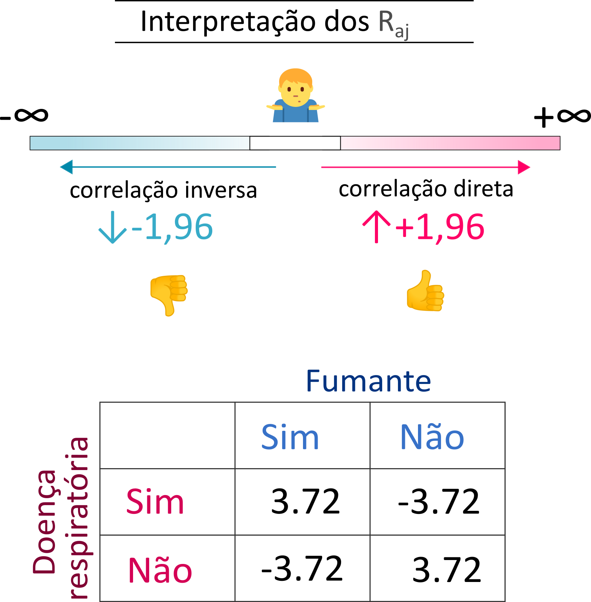

background-image: url(fig/background.png)
background-size: cover

.center[
## .big-text[Hola!]

### Marília Melo Favalesso

.pull-left[


`r icons::icon_style(icons::fontawesome("envelope", style = "solid"), fill = "#000000")` [mariliabioufpr@gmail.com](mariliabioufpr@gmail.com) 
`r icons::icon_style(icons::fontawesome("globe-americas", style = "solid"), fill = "#000000")` [www.mmfava.com](www.mmfava.com)
`r icons::icon_style(icons::fontawesome("github"), fill = "#000000")` [ github.com/mmfava](https://github.com/mmfava)
]
]

.pull-right[
.center[**Educação**]

`r icons::icon_style(icons::fontawesome("graduation-cap", style = "solid"), fill = "#000000")` Estudante de doutorado em ['Ecología, Genética y Evolución'](http://www.ege.fcen.uba.ar/home/), 2018 - atual, *Universidad de Buenos Aires*, Argentina.
<br>

`r icons::icon_style(icons::fontawesome("graduation-cap", style = "solid"), fill = "#000000")` [Mestre em Conservação e Manejo de Recursos Naturais](https://www5.unioeste.br/portalunioeste/pos/pprn), 2016 - 2018, Universidade estadual do Oeste do Paraná, Brasil.
<br>

`r icons::icon_style(icons::fontawesome("graduation-cap", style = "solid"), fill = "#000000")` [Bacharela em Ciências Biológicas](http://www.palotina.ufpr.br/portal/ciencias-biologicas/), 2010 - 2014, Universidade Federal do Paraná, Brasil.
<br>

`r icons::icon_style(icons::fontawesome("graduation-cap", style = "solid"), fill = "#000000")` [Técnica em Meio-ambiente](https://www.ceepcascavel.com.br/), 2005 - 2009, CEEP Pedro Boaretto Neto, Brasil.
]

---
## Lembre-se!

### **Pergunte, pergunte & perguntas!** ✋🎤 💬
<br>

### **Aula de revisão de conteúdos e exercícios!** ✏️
<br>

### **De preferência, mantenha a câmera ligada** 📷
<br>

### **Respeitar os colegas e a profa.** 👊
<br>

### **Tentar se divertir durante a aula.** 🥳
<br>

---
## Conteúdo programático da mini-aula

- [O que é correlação](#correlation)
   - [Correlação ≠ Causalidade](#causalidade)

- [Correlação linear](#cor_linear)
   - [Coeficiente de correlação produto-momento (r)](#dir)
   - [Exercício](#exe1)

- $\chi^2$ [de associação](#qui)
   - [Resíduos ajustados](#qui)
   - [Exercício](#exe2)

---
name: correlation
class: middle, center

# O que é correlação?

---
## O que é correlação?

> Em estatística, a **correlação** mede a **direção** e a **intensidade** de uma relação entre duas variáveis.


- Por exemplo:

  - **↑**🌡️ **↑**🍧**?**
  
  - **↑**📚 **↑**💰**?**
  
  - **↑**🍆 **↓**🐷**?**
  
  - **↑**🚴 **↓**💨**?**
  
  - **↑**🙋  **↑**🦵**?**
  
  - **↑**🚬  **↑**👃**?**
  
> Quando se pode demonstrar que existe associação entre duas variáveis, isto é, quando se constata que elas variam juntas, diz-se que as variáveis estão **correlacionadas**. 

---
## O que é correlação?

### Correlação ≠ Causalidade

.center[
### **↑**🦵 ~ **↑**🙋 **?**

```{r echo=FALSE, fig.height=5, fig.width=6, message=FALSE, warning=FALSE, dev.args=list(bg = 'transparent')}
library(tidyverse) # manipulação dos dados
library(janitor) # limpeza dos dados

braco <- c(50:70)
perna <- c(70:90)

data.frame(perna, braco) %>%
  ggplot(aes(x = perna, y = braco)) + 
  geom_point(fill = "black", color = "red", alpha = .9, size = 4) +
  xlab("Braço (cm)") +
  ylab("Perna (cm)") + 
  theme_bw(base_size = 14) +
  theme(plot.background = element_rect(fill = "transparent", colour = NA))
```
]

---
name: cor_linear
class: middle, center

# Correlação linear
---
name: dir
## Correlação linear

### Coeficiente de correlação produto-momento (r)

- O **r** (*rhô*) é uma medida da força e direção da correlação entre duas variáveis quantitativas e também é conhecido como **coeficiente de correlação de Pearson**.

.center[]

---
## Correlação linear

### Direção da correlação

.center[]

<small>
> A partir dos diagramas de dispersão, já temos uma indicação se a relação entre as variáveis é **positiva** (quando as duas crescem juntas), **negativa** (quando uma aumenta e a outra diminui) ou se **não há correlação**.
</small>

---
## Correlação linear

### Intensidade da correlação

.center[]

---
name: exe1

## Correlação linear

### Exercício 💻

Existe associação entre o PIB total (R$) dos municípios brasileiros e o tamanho de suas populações?

```{r eval=TRUE, message=FALSE, warning=FALSE, include=FALSE}
setwd("C:/Users/mmfav/OneDrive/GitHub/curso_ENAP/Trabalho_final")

## Pacotes ----
library(tidyverse) # manipulação dos dados
library(janitor) # limpeza dos dados
library(dados) # contém a planilha de dados

## Importar os dados ----
# • Para importar os dados em .csv, utilizamos a função "read.csv". 
dados_socio_economicos <- 
  read_csv("dados_socio_economicos.csv") %>% # importação da tabela
  clean_names # examinar e limpar os nomes das colunas

dados_socio_economicos %>% names # Consultar as variáveis contidas na tabela
```

```{r eval=FALSE, message=FALSE, warning=FALSE, include=TRUE}
## Pacotes ----
library(tidyverse) # manipulação dos dados
library(janitor) # limpeza dos dados

## Importar os dados ----
# • Para importar os dados em .csv, utilizamos a função "read.csv". 
dados_socio_economicos <- 
  read_csv("dados_socio_economicos.csv") %>% # importação da tabela
  clean_names # examinar e limpar os nomes das colunas

dados_socio_economicos %>% names # Consultar as variáveis contidas na tabela
```

<small>
\#\# [1] "uf" "cod_uf" "cod_municipio" "nome_do_municipio" "populacao_estimada" "pib_per_capita" "pib_total_em_r_mi" <br>
\#\# [2] "atividade_economica" "ranking_pib_per_capita" "ranking_pib_total" 
</small>

---
## Correlação linear

### Exercício 💻

```{r eval=FALSE, message=FALSE, warning=FALSE, include=TRUE}
## Plotar os dados em um gráfico de dispersão ---
dados_socio_economicos %>% # tabela de dados
  ggplot(aes(x = populacao_estimada, y = pib_total_em_r_mi)) + # var linha e colunax
  geom_point() + # transparência e tamanho dos pontos 
  xlab("População estimada") + # nome do eixo X
  ylab("PIB total (R$)") # nome do eixo Y
```

<center>

```{r echo=FALSE, fig.height=4, fig.width=6.5, message=FALSE, warning=FALSE}
library(ggplot2)
library(plotly)
library(gapminder)

p1 <- 
  dados_socio_economicos %>%
  ggplot(aes(x = populacao_estimada, y = pib_total_em_r_mi)) + 
  geom_point(aes(text = c(nome_do_municipio)) ) +
  xlab("População estimada") +
  ylab("PIB total (R$)") + 
  theme_bw(base_size = 10) +
  theme(plot.background = element_rect(fill = "transparent", colour = NA),
        legend.position="none") +
  scale_x_continuous(labels = function(x) format(x, scientific = TRUE))

ggplotly(p1, tooltip = c("text"))
```

</center>

---
## Correlação linear

### Exercício 💻

```{r eval=FALSE, message=FALSE, warning=FALSE, include=TRUE}
## Plotar os dados com transformação nos eixos  ---
dados_socio_economicos %>% 
  ggplot(aes(x = populacao_estimada, y = pib_total_em_r_mi)) + 
  geom_point() +  
  scale_x_log10() + #<< 
  scale_y_log10() + #<<
  xlab("População estimada") + ylab("PIB total (R$)") 
```

---
## Correlação linear

### Exercício 💻

```{r eval=FALSE, message=FALSE, warning=FALSE, include=TRUE}
## Plotar os dados com transformação nos eixos  ---
dados_socio_economicos %>% 
  ggplot(aes(x = populacao_estimada, y = pib_total_em_r_mi)) + 
  geom_point() +  
  scale_x_log10() + # transformação log dados do eixo x
  scale_y_log10() + # transformação log dados do eixo y
  xlab("População estimada") + ylab("PIB total (R$)") 
```

<center>

```{r echo=FALSE, fig.height=3.8, fig.width=6.5, message=FALSE, warning=FALSE}
p2 <- 
  dados_socio_economicos %>%
  ggplot(aes(x = populacao_estimada, y = pib_total_em_r_mi)) + 
  geom_point(aes(text = c(nome_do_municipio)) ) +   scale_x_log10() +
  scale_y_log10() +
  xlab("População estimada") +
  ylab("PIB total (R$)") + 
  theme_bw(base_size = 10) +
  theme(plot.background = element_rect(fill = "transparent", colour = NA),
        legend.position="none") 


ggplotly(p2, tooltip = c("text"))
```

</center>

---
## Correlação linear

### Exercício 💻

- Para finalizar, precisamos calcular o **r** para os nossos dados:

```{r}
cor(
  dados_socio_economicos$populacao_estimada, 
  dados_socio_economicos$pib_total_em_r_mi
  )
```

> Existe uma correlação **\_\_\_\_\_\_\_\_\_\_**  e **\_\_\_\_\_\_\_\_\_\_** entre a população estimada e o PIB total (r = **\_\_\_\_**).

---
## Correlação linear

### Exercício 💻

- Para finalizar, precisamos calcular o **r** para os nossos dados:

```{r}
cor(
  dados_socio_economicos$populacao_estimada, 
  dados_socio_economicos$pib_total_em_r_mi
  )
```

> Existe uma correlação **positiva**  e **muito forte** entre a população estimada e o PIB total (r = **0,96**).

---
name: qui
class: middle, center

# $\chi^2$ de associação
## Resíduos ajustados

---
## $\chi^2$ de associação

### Resíduos ajustados

- Os resíduos do $\chi^2$ (qui-quadrado) de associação ou de independência são utilizados para avaliar a correlação entre **variáveis categóricas**, assim como o coeficiente **r** é usado para o mesmo fim com variáveis quantitativas. 

- **Exemplo:** 
  - A presença de doenças respiratórias está associado ao tabagismo? (amostra: n = 40).

.center[]

---
## $\chi^2$ de associação

### Gráfico de barras empilhadas

.center[
```{r echo=FALSE, message=FALSE, warning=FALSE, fig.height=6, fig.width=9}
f <- c("fumante", "fumante", "não fumante", "não fumante")
dr <- c("doença respiratória", "saudável", "doença respiratória", "saudável")
qt <- c(20, 3, 5, 12)

data.frame(f, dr, qt) %>%
  ggplot(aes(fill = dr, y = qt, x = f)) +
  geom_bar(position = "stack", stat = "identity") +
  labs(legend = "") +
  scale_fill_discrete(name = "") +
  xlab("") +
  ylab("Frequência") + 
  theme_bw(base_size = 17) +
  theme(plot.background = element_rect(fill = "transparent", colour = NA))
```
]

---
## $\chi^2$ de associação

### Resíduos ajustados

.center[]

> No **R** usamos a função `chisq.test(X, Y)$stdres` para obter os $R_{aj}$.

---
name: exe2
## $\chi^2$ de associação

### Exercício 💻

- Existe associação entre raça e identificação partidária para os entrevistados pelo *US General Social Survey*?

```{r}
## Pacotes ----
library(tidyverse) # manipulação de dados + gráficos
library(janitor) # limpeza nos dados
library(dados) # onde está a tabela de dados
library(viridis) # para usar a paleta de cores viridis
library(corrplot) # usaremos para plotar os resíduos

## Chamar os dados da tabela 'questionario'{dados} ----
questionario <- questionario %>% clean_names 

questionario %>% names # variáveis da tabela
```

---
## $\chi^2$ de associação

### Exercício 💻

.pull-left[
**Gráfico de barras empilhadas**

```{r eval=FALSE, message=FALSE, warning=FALSE, include=TRUE}
## Para criar o gráfico usamos o pacote 'ggplot'

questionario %>% # incluimos nossos dados
  ggplot(aes(y = raca, # raça vai no eixo "y"
             fill = partido)) + # as barras empilhadas correspondem a partido
  geom_bar( # usamos a função "geom_bar" para criar o grafico
    position = "fill" # posição das barras no gráfico
    ) + 
  scale_fill_viridis( # usamos a paletta de cores 'viridis'...
    discrete = TRUE, # ... para dados discretos
    name = "Partido") + # título da legenda
  xlab("Frequência relativa") + # nome do eixo x
  ylab("Raça") # nome do eixo y
```
]

.pull-right[
```{r echo=FALSE, message=FALSE, warning=FALSE, fig.height=6, fig.width=9}
questionario %>% # nossos dados
  ggplot(aes(y = raca, fill = partido)) + # dados para o gráfico
  geom_bar(position = "fill") + # tipo de gráfico: barra empilhada
  scale_fill_viridis(discrete = TRUE, name = "Partido") + # cores + nome legenda
  theme_bw(base_size = 16) +
  theme(plot.background = element_rect(fill = "transparent", colour = "grey90")) +
  xlab("Frequência relativa") +
  ylab("Raça")
```
]

---
## $\chi^2$ de associação

### Exercício 💻

**Análise dos resíduos**

<div style="width: 1050px; height: 380px; white-space: nowrap; overflow-x: scroll; overflow-y: scroll; 
border: 0; padding: 0px; display: inline-block;">
```{r eval=FALSE, fig.height=6, fig.width=9, message=FALSE, warning=FALSE, include=TRUE}
chisq.test(questionario$raca, 
           questionario$partido)$stdres %>%
  corrplot(is.cor = FALSE)
```

```{r echo=FALSE, fig.height=6, fig.width=12, message=FALSE, warning=FALSE}
chisq.test(questionario$raca, 
           questionario$partido)$stdres %>%
  corrplot(is.cor = FALSE) +
  theme_bw(base_size = 17)
```

> Observamos que há uma associação **positiva** entre a raça preta e o <br>
partido democrata; e entre brancos e o partido republicano.

---
## Dúvidas?

.center[

<https://www.menti.com/hs6etjj2u9> (cod: 7513-1177)
]

---
class: center

<br>
## FIM!

<br>
.center[]

